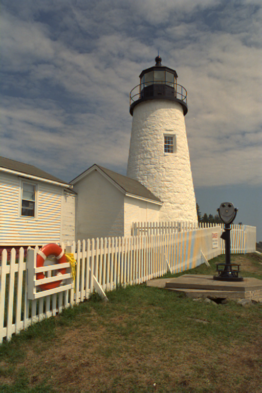
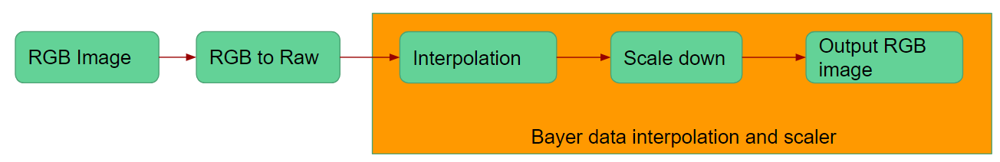

# RawScaler 

This is an image processing demo project , which can do raw data interpolation and also scaling.

2018 Avisonic

## Feature 

1. Hight quility bayer interpolation and scaler in raw domain
2. Can be build in pure C++ project (No dependence library)
3. Cmake build (support linux and windows platform)

## Performance

### Original image and raw


 <br>

Original image (Top) and convert it to raw data (Bottom)


### Raw to rgb (our interpolation)


### Raw to rgb (opencv interpolation)



## Processing Flow 



## Windows Setup

### Requirements

 - Visual Studio 2013 or 2015
 - [CMake](https://cmake.org/) 3.4 or higher (Visual Studio and [Ninja](https://ninja-build.org/) generators are supported)

### Optional Dependencies
 - OpenCV

### Building RawScaler (Windows)

```
> git clone https://gitlab.com/eric.liu/RawScaler.git
> cd $RawScaler_root/script
> build_win.cmd
> cd $RawScaler_root
> mkdir out
```

### Configuring RawScaler (Windows)

```
> Edit build_win.cmd
> Set DOpenCV_Enable ON/OFF 
```

## Linux Setup

### Building RawScaler (Linux)

```
> git clone https://gitlab.com/eric.liu/RawScaler.git
> cd $RawScaler_root
> sh build.sh
> mkdir out
```

### Configuring RawScaler

```
> Edit build_win.sh
> Set DOpenCV_Enable ON/OFF 
```

#### OpenCV_Enable=ON

1. If opencv enable , the resullt image will show on GUI 

#### OpenCV_Enable=OFF

1. The input file muse be bitmap file (.bmp)

### Demo 

#### Windows Run 

```
> cd $RawScaler_root
> script\build\Release\RawScaler.exe data\kodim19.bmp 300 300
```

RawScaler.exe file output-width output-height

1. arg can be null , the output file are stored in $RawScaler_root\out <br>

#### Linux Run

```
> cd $RawScaler_root
> ./RawScaler data/kodim19.bmp 300 300
```
